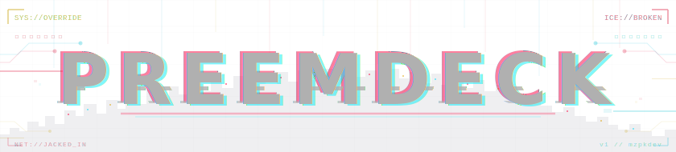

<p align="center">
  
</p>

## Install

```bash
curl -fsSL https://raw.githubusercontent.com/mzpkdev/preemdeck/main/boot.sh | bash
```

The bootstrap clones the source to `~/.preemdeck` (its own directory — your `~/.claude` / `~/.codex` / `~/.gemini`
config is left in place) and runs `install.py <harness>`. The default harness is `claude`; pass another to target it —
`… | bash -s codex`.

The installer registers preemdeck's marketplaces/plugins by absolute path into `~/.preemdeck`, then copies the
per-harness overlay (settings + the `fixer` agent) into your host config dir. Any file it overwrites is backed up once
to `<file>.bak` first. Restart your CLI afterward to load the plugins.

## Update / Uninstall

```bash
python3 ~/.preemdeck/update.py              # git pull --ff-only, then re-install every recorded harness
python3 ~/.preemdeck/uninstall.py [harness] # restore backups, unregister plugins; --dry-run to preview, --purge to print the rm -rf
```
